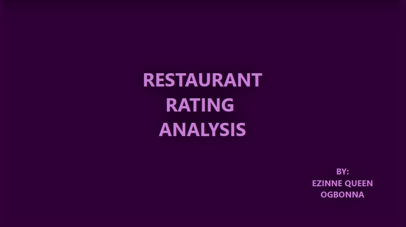
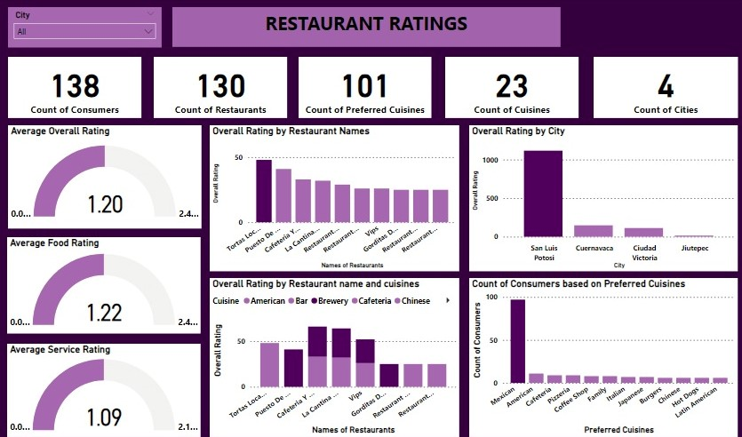
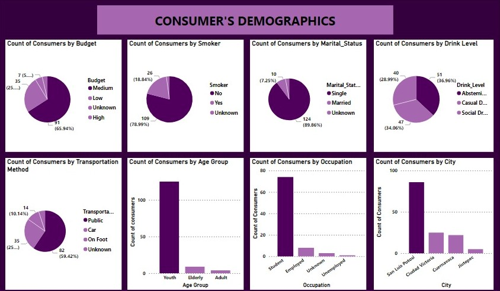
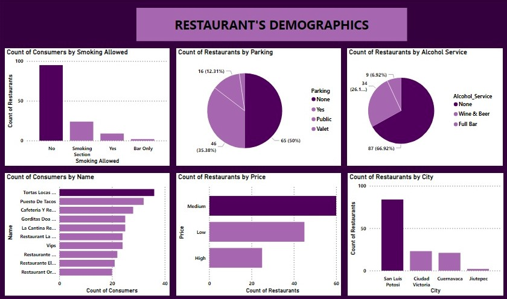

# RESTAURANT RATING ANALYSIS

---
## Overview

This dataset is called the Restaurants rating dataset which contains information about restaurants in Mexico. A Customer survey was carried out in 4 cities in 2012 to collate information about each restaurant, their cuisines, information about their consumers and the preferences of the consumers. It contains five tables.
Analysis was conducted to draw out meaningful insights which would aid business entrepreneurs and investors in making more informed decisions.

## Analysis Tool 

Power BI.

## Category

Customer Analysis.

## Problem Statement

1. What can you learn from the highest rated restaurants? Do consumer preferences have an effect on ratings?
2. What are the consumer demographics? Does this indicate a bias in the data sample?
3. Are there any demand & supply gaps that you can exploit in the market?
4. If you were to invest in a restaurant, which characteristics would you be looking for?

## Skills/Concepts demonstrated:

The following Power BI features were incorporated;
- Data cleaning,
- New measures,
- Conditional columns,
- Slicers
- Filters.

## Visualization

The report comprises of 6 pages:
1. Title,
2. Overview,
3. Restaurants Ratings Analysis,
4. Consumer’s Demographics Analysis,
5. Restaurant’s Demographics Analysis
6. Findings & Recommendations.

## Analysis

### Restaurants Ratings Analysis 

There are 138 consumers, 130 restaurants, 101 preferred cuisines, 23 cuisines, and 4 cities involved in this survey. The top three highest rated restaurants by overall rating were Tortas Locus Hipocampo, Puesto De Tacos, and Cafeteria Y Restaurant El Pacifico. The top cuisine in the restaurants was Mexican cuisine. Mexican cuisine was also a preferred cuisine by consumers. By comparison, this indicates that preferred cuisine has an effect on the ratings.
N/B: There is also a bias because of the country these restaurants are located.

## Consumer’s Demographics Analysis

Based on consumer's demographics analysis, a large number of the consumers were youths(18-31), single, students, live in San Luis Potosi city, medium budget earners, non-smokers, abstemious drinkers, and use public transportation methods.

## Restaurant’s Demographics Analysis

Since the consumers are mostly single students, most services should be tailored to them. More restaurants should be opened in school areas or close to school areas and should offer medium and low pricing.

## RECOMMENDATION

As an investor, I will recommend to invest in any of the restaurants with the following characteristics:
- Restaurants in school areas or close proximity to school areas.
- Restaurants in San Luis Potosi city.
- Restaurants that can be accessed by public transports
- Restaurants that offer medium and low pricing.
- Finally, restaurants with high ratings.

